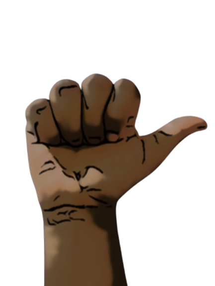
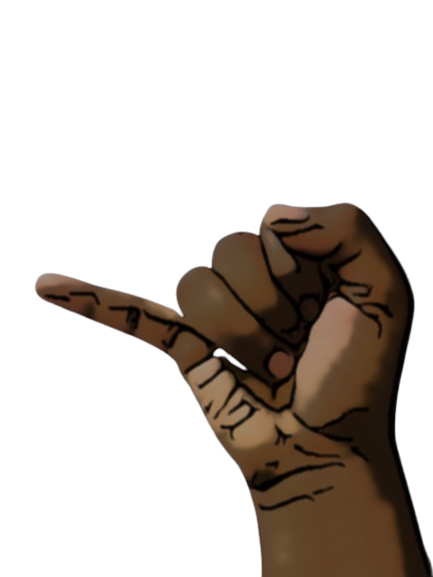
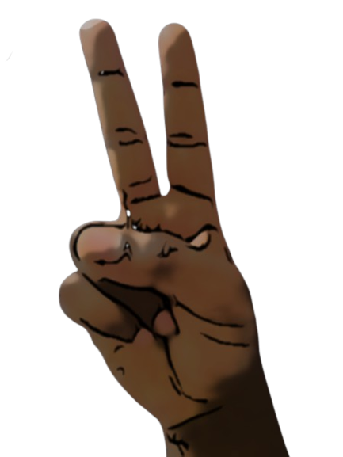
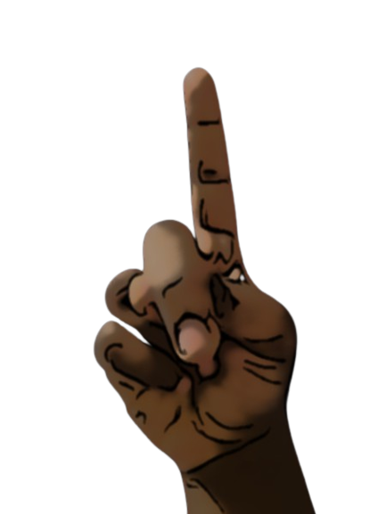
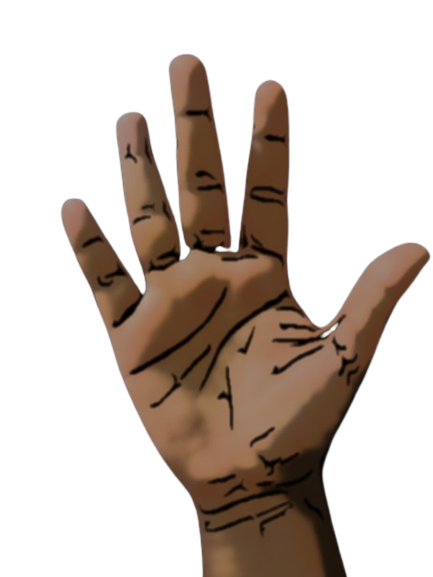

# Hand Gesture Controller
An application based on Landmark Detection used for giving presentations with the help of Hand Gestures i.e without the use of any mouse or touch-pad.

## Introduction
This project by TY-47 is intended to give presentations in air - without touching the screen or use of mouse. User can swipe the slides, use pointer as well as draw on slides. As soon as the user shows up his hand in the camera the application detects it. Whenever user makes gestures they are detected and actions associated to those gestures are performed. 

## Features
Currently following functionalities have been implemented:

## **Next Slide**&emsp;&emsp;&emsp;&emsp;&emsp;&emsp;&emsp;&emsp;&emsp;&emsp;&emsp;&emsp;&emsp;&emsp;&emsp;&emsp;&emsp;&emsp;&emsp;&emsp;&emsp;&emsp;&emsp;

## **Previous Slide**&emsp;&emsp;&emsp;&emsp;&emsp;&emsp;&emsp;&emsp;&emsp;&emsp;&emsp;&emsp;&emsp;&emsp;&emsp;&emsp;&emsp;&emsp;&emsp;

## **Pointer**&emsp;&emsp;&emsp;&emsp;&emsp;&emsp;&emsp;&emsp;&emsp;&emsp;&emsp;&emsp;&emsp;&emsp;&emsp;&emsp;&emsp;&emsp;&emsp;&emsp;&emsp;&emsp;&emsp;&emsp;

## **Draw**&emsp;&emsp;&emsp;&emsp;&emsp;&emsp;&emsp;&emsp;&emsp;&emsp;&emsp;&emsp;&emsp;&emsp;&emsp;&emsp;&emsp;&emsp;&emsp;&emsp;&emsp;&emsp;&emsp;&emsp;

## **Erase**&emsp;&emsp;&emsp;&emsp;&emsp;&emsp;&emsp;&emsp;&emsp;&emsp;&emsp;&emsp;&emsp;&emsp;&emsp;&emsp;&emsp;&emsp;&emsp;&emsp;&emsp;&emsp;&emsp;&emsp;&emsp;

## **Clear Screen**&emsp;&emsp;&emsp;&emsp;&emsp;&emsp;&emsp;&emsp;&emsp;&emsp;&emsp;&emsp;&emsp;&emsp;&emsp;&emsp;&emsp;&emsp;&emsp;&emsp;&emsp;&emsp;

Also, PPT in form of images is needed for it to work.

## Libraries Used
1. OpenCV Library (For Image Processing and Drawing)
2. MediaPipe Library (For Handtracking)
3. Numpy

